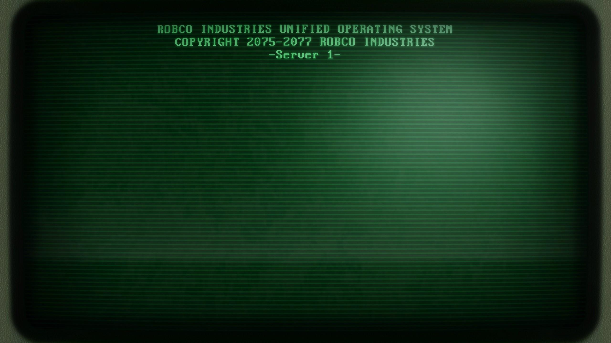

---
# ─────────────────────────────────────────────────────────────────────────────
# REQUIRED — the layout, and the four fields every card/header needs.
# ─────────────────────────────────────────────────────────────────────────────
layout: ../../layouts/ArticleLayout.astro
title: "Linux fundamentals: the 20 commands that carry the other 200"
description: "Permissions, processes, pipes and paths — the base layer every exploit, every hardening guide and every CI pipeline assumes you already know."
pubDate: 2026-09-11
category: "Defensive Ops"        # Exploits | Crypto | Defensive Ops  (add more in src/lib/categories.js)

# ─────────────────────────────────────────────────────────────────────────────
# OPTIONAL — delete any line you don't need.
# ─────────────────────────────────────────────────────────────────────────────
heroImage: "/images/linux-fundamentals.jpg"   # full-bleed image under the header.
                                              # Path is relative to src/assets, so this file
                                              # lives at src/assets/images/linux-fundamentals.jpg
heroImageAlt: "A terminal session on a dark background"
author: "Neekoy"                 # defaults to "Neekoy" when omitted
cve: ""                          # e.g. "CVE-2026-41880" — renders next to the category
cvss:                            # e.g. 9.8 — renders the red CVSS badge (header + card)
tags: ["linux", "shell", "permissions", "beginner"]
draft: true                     # true hides the post from the feed, nav and 404 list
# readingTime: DO NOT SET — computed from the body at ~200 wpm
---

Every write-up on this blog eventually bottoms out in the same handful of Linux concepts. Privilege escalation is a
permissions question. Container escape is a namespace question. Half of all detection engineering is reading process
trees. So before the fun stuff: **the base layer, in the order it actually matters**.

## Everything is a file

Devices, sockets, kernel state — all of it is exposed through the filesystem, which is why `/proc` is the first place
to look on any box you don't recognise.

```bash
cat /proc/self/status        # limits, capabilities, parent pid
cat /proc/net/tcp            # open sockets, no netstat needed
ls -l /proc/1/exe            # what actually booted as PID 1
```

That last one matters more than it looks: in a container, PID 1 is your entrypoint, and comparing it against
`/proc/1/cgroup` is the fastest way to tell whether you are in one.

## Permissions, properly

The three-digit mode everyone memorises hides the two mechanisms that actually cause incidents: the setuid bit and
directory execute permission.

| Mode | Meaning on a file | Meaning on a directory |
| --- | --- | --- |
| `r` | read contents | list entries |
| `w` | modify contents | create and delete entries |
| `x` | execute | traverse into it |
| `s` | run as the owner (setuid) | new files inherit the group (setgid) |

> A directory with `w` but no `x` is unreadable but still writable — and a directory with `x` but no `r` lets you open
> a known path inside it while `ls` returns nothing. Both are used deliberately in hardened layouts, and both confuse
> automated scanners.

Find the setuid binaries before someone else does:

```bash
find / -perm -4000 -type f 2>/dev/null
```

Anything in that list that is not from your distribution's package manager deserves an explanation.

## Processes and signals

A process is a pid, a parent, a user, and a set of open file descriptors. That is the whole model.

1. `ps -ef --forest` — the tree, not the list
2. `lsof -p <pid>` — what it has open, including deleted-but-held files
3. `kill -l` — the signal table; `TERM` asks, `KILL` does not
4. `strace -f -p <pid>` — when nothing else explains the behaviour

The one that surprises people: **a deleted file is not gone while a process still holds the descriptor**. Disk stays
full, and the contents are still readable through `/proc/<pid>/fd/`.

<!-- ─────────────────────────────────────────────────────────────────────────────
     INLINE IMAGE — this is the whole pattern. Standard Markdown, nothing else.

     • Put the file in  src/assets/images/  and reference it with a RELATIVE path.
       From src/pages/articles/ that is  ../../assets/images/<name>.<ext>
       A relative path under src/ is what triggers the build-time pipeline.
     • Do NOT use an absolute /images/... path, and do NOT hand-write a raw img
       tag. Both bypass optimization and ship the original bytes untouched.
     • Astro fills in width, height, loading="lazy", decoding="async", plus a
       srcset + sizes, from the file itself. Never hand-write those — they can
       only go stale when you swap the image.
     • Output is WebP with a content-hashed filename, so it caches immutably.
     • alt describes what the image shows technically — never "screenshot".
     • Filenames are case-sensitive on Cloudflare Pages — keep them lowercase-kebab.
     • No need to pre-compress or pre-resize: the build re-encodes and emits a
       width ladder. Commit the highest-quality original you have.
     ───────────────────────────────────────────────────────────────────────── -->



Read the indentation, not the pids: reparenting to PID 1 is what tells you the original parent is already gone.

## Pipes are the point

The shell's real feature is that small programs compose. This is a rough-and-ready top-talkers report from an access
log, with no tooling installed:

```bash
awk '{print $1}' access.log \
  | sort \
  | uniq -c \
  | sort -rn \
  | head -20
```

Once you internalise `sort | uniq -c | sort -rn`, you stop reaching for a dashboard to answer simple questions.

<!-- A second image, same pattern. Styling is automatic: the border comes from
     `prose-img:border prose-img:border-slate-800` in ArticleLayout.astro, so
     body images never need classes. If you want a caption, you need MDX — the
     plain-Markdown trade-off is deliberate. -->


### Redirection you will actually use

```bash
cmd > out.log 2>&1      # stdout and stderr to one file
cmd 2>/dev/null         # discard errors only
cmd | tee out.log       # see it and save it
cmd <<< "inline input"  # here-string
```

## Where to go next

Pick a box you own, then read [the archive](/#feed) alongside it — the [detection write-ups](/#recent) assume exactly
the model above, and nothing more.

---

*This file is the kitchen-sink example: copy it, strip the comments, and keep the frontmatter block. Every feature the
article layout supports — hero image, inline figures, tags, TOC from the `##` headings, prev/next nav, Shiki-highlighted
code, tables, blockquotes, footnote-style italics — appears somewhere above.*
